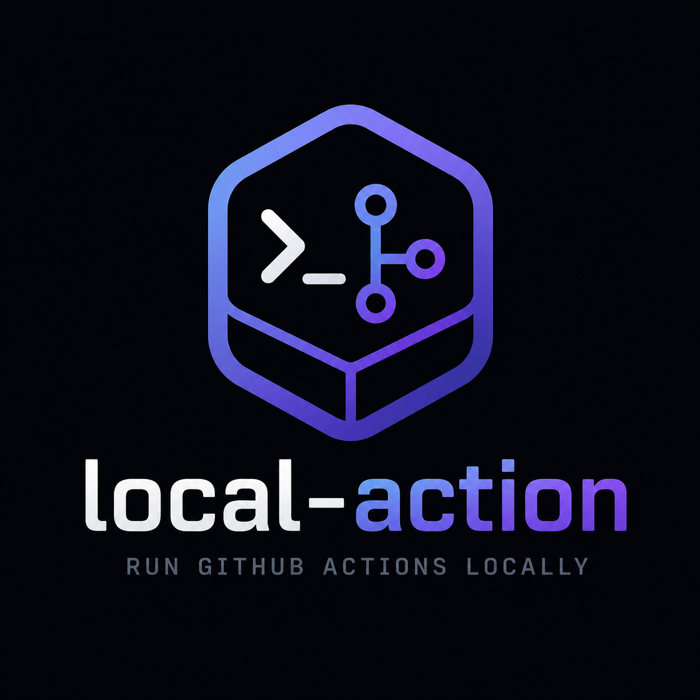

<p align="center">
  
</p>

<p align="center">
  <a href="https://github.com/adishM98/local-action/releases/latest"></a>
</p>

Selfhosted web UI for running GitHub Actions workflows locally, via Docker — wraps [`act`](https://github.com/nektos/act) so you get a browser UI (secrets, env/vars, run history, live logs) instead of memorizing CLI flags.

Single user, no auth, no accounts. Meant to run on your own machine or a home server, bound to `localhost` only.

<p align="center">
  <video src="docs/demo.mp4" poster="docs/application.png" controls muted loop width="800">
    Your browser doesn't support inline video —
    <a href="docs/demo.mp4">watch/download the demo here</a>.
  </video>
</p>

## Install

### macOS, DMG app (recommended — no terminal needed)

[Download the latest `.dmg`](https://github.com/adishM98/local-action/releases/latest), open it, drag **LocalAction** to Applications, launch it. Opens as a real app — Dock icon, native window — no separate browser tab. arm64 (Apple Silicon) only for now.

If your browser doesn't actually start the download (some silently swallow `.dmg` links), grab it with curl instead:

```bash
curl -L -o local-action.dmg https://github.com/adishM98/local-action/releases/latest/download/local-action_darwin_arm64.dmg
open local-action.dmg
```

`act` ships bundled inside the app — nothing to install for it. Just needs Docker running.

Unsigned (no Apple Developer ID yet) — first launch will warn "Apple could not verify..."; right-click → Open once to bypass it.

### macOS, via Homebrew (terminal, prebuilt binary)

```bash
brew install adishM98/local-action/local-action
```

Installs `act` automatically as a dependency. Still needs Docker installed and running separately.

Then start it:

```bash
local-action
```

Open `http://localhost:8090`.

### Or a prebuilt binary directly (macOS)

```bash
curl -L -o local-action https://github.com/adishM98/local-action/releases/latest/download/local-action_darwin_arm64   # or _amd64 on Intel
chmod +x local-action
./local-action
```

Needs `act` and Docker installed and running separately — see [Requirements](#requirements) below (`make bootstrap` from a cloned checkout can install those even if you're not building the binary yourself). See [docs/RELEASE.md](docs/RELEASE.md) for how releases are built.

For any other platform, or to hack on the source, see below.

## Requirements

- **Go 1.25+** (only if building from source)
- **Docker**, installed and running
- **[`act`](https://github.com/nektos/act)**, installed and on your `PATH` (`act --version` should work)
- **Node.js + npm** (only if rebuilding the frontend)

## Quick start

Don't have Go/Node/`act` installed? Run the bootstrap script first — installs whatever's missing (via Homebrew on macOS, `apt`/act's official installer on Linux), checks Docker is running, and stops with a link if it hits something it can't safely automate:

```bash
make bootstrap
```

Then:

```bash
make run
```

Builds the frontend (first time only, or after `web/src` changes), builds the Go binary, and starts it. Open `http://localhost:8090`.

Other targets:

| Command | Does |
|---|---|
| `make bootstrap` | Install missing build dependencies (Go, Node, act); checks Docker |
| `make build` | Build frontend + binary, don't run |
| `make dev` | Backend (`go run .`) + frontend dev server (hot reload) together, Ctrl-C stops both |
| `make test` | `go test ./...` + frontend unit tests (`npm test`) |
| `make lint` | `gofmt -l .` + `go vet ./...` (check only, doesn't modify files) |
| `make fmt` | `gofmt -w .` — formats Go files in place |
| `make install` | Install Go + npm dependencies, no build |
| `make db-reset` | Remove the local SQLite DB (run history + secrets), keep the binary and built frontend |
| `make clean` | Remove the binary, local DB, built frontend, and `node_modules` |
| `make release-macos VERSION=x.y.z` | Build prebuilt macOS binaries (arm64+amd64) for a GitHub release — see [docs/RELEASE.md](docs/RELEASE.md) |
| `make package-macos-app VERSION=x.y.z` | Build the double-click DMG app (arm64 only) — see [docs/RELEASE.md](docs/RELEASE.md) |

Flags:

| Flag | Default | Meaning |
|---|---|---|
| `-addr` | `127.0.0.1:8090` | Listen address. Change only if you understand the risk — see [Security](#security). |
| `-db` | `local-action.db` | Path to the SQLite database file (run history + encrypted secrets). |
| `-act-bin` | `act` | Path to the `act` executable, if not on `PATH`. |

## Using it

1. **Point it at a repo** — click the repo name/path in the header, enter the absolute path to a local repo (must contain `.github/workflows/`). Shows the repo's current branch, and Docker/`act` health.
2. **Overview** — the landing page: workflow/running/failed/passing counts, currently-running and recent-failure widgets, a recent-runs feed, repository health (success rate, avg build/queue time, longest run), a 7-day success-rate trend, and any pinned (⭐) workflows.
3. **Workflow Explorer** (sidebar) — workflows grouped into categories (CI/Build, Security, Testing, Deployment, Docs), auto-detected from name/path. Search (⌘K) or filter by status (running/failed/success/never run). Pin frequently-used workflows to Favorites. Drag the right edge to resize, or collapse it entirely.
4. **Run a workflow** — pick the trigger event and fill in any `workflow_dispatch` inputs (text, choice, or a checkbox for boolean inputs), then click Run. If a job's `if:` condition depends on event data GitHub Actions can't auto-derive locally, an event-payload JSON field appears — pre-filled with a best-effort guess when derivable, otherwise blank for manual entry. A banner warns if the workflow's `runs-on` targets `windows-*`/`macos-*`/`self-hosted` — `act` only emulates Linux runners, so those may fail or diverge from real CI.
5. **Watch it run** — opens a live log stream (WebSocket) grouped by job/step; re-run or cancel from the same view. Past runs stay in history for the repo.
6. **Secrets & variables** — add secrets/vars scoped to the repo (optionally to one workflow). Values are encrypted at rest and injected into the run as a temporary dotenv file, deleted immediately after the run finishes.

Runs execute one at a time, FIFO — triggering a second run while one is in progress queues it. The theme toggle (next to Docker/`act` status) switches dark/light; it otherwise follows your OS preference.

## Building the frontend

The UI is a Vite/React app at top-level `web/`, built to static assets and embedded into the Go binary via `go:embed` (declared in `web/embed.go` — `go:embed` can't reach outside the directory tree of the file that declares it, so the embed lives inside `web/` itself, and `cmd/local-action` imports the resulting `web.Dist` as an ordinary package). `make build`/`make run` handle this automatically (only rebuilds when `web/src` actually changed). To do it by hand instead:

```bash
cd web
npm install   # first time only
npm run build
cd ..
go build -o local-action ./cmd/local-action
```

For frontend-only iteration with hot reload, use `make dev`, or by hand (backend must be running separately on `:8090`):

```bash
cd web
npm run dev
```

## Project layout

```
cmd/local-action/       entrypoint: main.go (flags, wiring, HTTP server startup) — plain CLI binary
cmd/local-action-gui/   entrypoint for the DMG app — same server, wrapped in a native webview window
web/                    Vite/React frontend (src/, dist/ built output, package.json, embed.go)
internal/
  db/                   SQLite schema + OpenDB
  secrets/              encrypted secrets/vars store, AES-GCM
  workflows/            .github/workflows/*.yml parsing, category overrides, saved event payloads
  runs/                 run history/log storage, act invocation engine (FIFO queue)
  ws/                   WebSocket log-streaming hub for run output
  terminal/             pty-backed shell sessions behind the in-app terminal panel
  update/               checks GitHub releases for a newer version (check-only, never installs)
  httpapi/              HTTP route wiring
assets/                 source logo assets used to generate the DMG app's Dock icon
testdata/sample-repo/   a real workflow file, for manual end-to-end testing
docs/                   architecture notes, design spec, user guide, release process
scripts/                bootstrap.sh (dev setup), release-macos.sh + package-macos-app.sh + release.sh
                        (prebuilt-binary + DMG releases), flatten-icon.swift (Dock icon generation)
homebrew-tap/           Formula/local-action.rb — synced into the separate homebrew-local-action tap repo on release
```

## Security

- No authentication. Anyone who can reach the listening address can trigger workflow runs (arbitrary code execution via Docker) and manage secrets. Keep `-addr` on `127.0.0.1` (the default) unless you understand and accept that risk — don't expose this to a network you don't fully trust.
- Secrets/vars are encrypted at rest with AES-256-GCM. The encryption key lives at `$XDG_CONFIG_HOME/local-action/seed.key` (or the OS equivalent), generated once on first run, permissions `0600`.
- Decrypted secret values are written to short-lived temp dotenv files (`0600`) only for the duration of a run, then deleted.

## Development

```bash
make test   # go test ./... + npm test
make lint   # gofmt -l . && go vet ./... (check only)
make fmt    # gofmt -w . (formats in place)
```

See `docs/ARCHITECTURE.md` for how the pieces fit together, and `docs/superpowers/` for the original design spec and implementation plan. See [`docs/USER_GUIDE.md`](docs/USER_GUIDE.md) for a full walkthrough of every screen and feature, and [`docs/RELEASE.md`](docs/RELEASE.md) for how prebuilt macOS binaries are built and published. Contributions welcome — see [CONTRIBUTING.md](CONTRIBUTING.md).

## License

[MIT](LICENSE)
